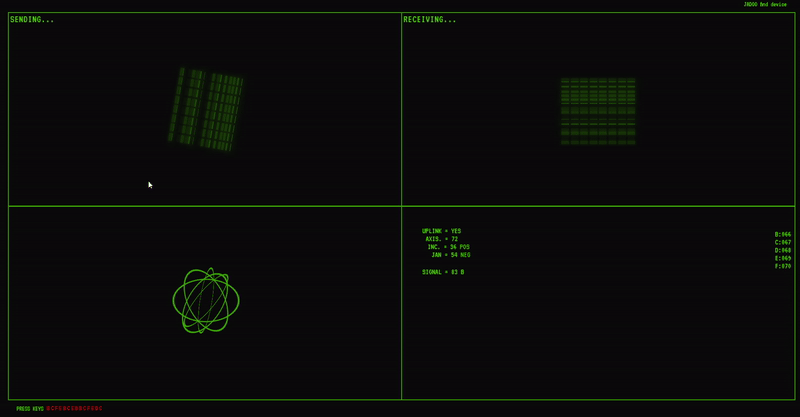

# Jadoo 👽

## Overview  
**Jadoo-Computer** is an interactive computing experience inspired by elements seen in films, where pressing specific keys triggers sounds. This project aims to create an immersive, fun, and engaging tool that brings interactive sound effects to life.


## 📸 Project Preview  
  

### 🔗 Live Preview  
Check out the live demo: [Jadoo Live Preview](https://short-zed.github.io/Jadoo-Computer/)  

---

## 🛠️ Features 
- **Sound-Based Interactivity**: Press specific keys to trigger distinct sounds for an immersive user experience.  
- **Custom Key Mappings**: Define custom key combinations to activate sounds.  
- **Intuitive Interface**: Simple and user-friendly design to enhance interaction.  
- **Cross-Platform Support**: Works on various platforms like Windows, macOS, and Linux.  
- **Dynamic Sound Effects**: Unique sound sequences triggered by predefined key combinations.  

---

## 🚀 How it Works  
1. **Press Keys to Activate Sounds**: Use the following key sequence to hear sounds:  
   - **b** → **c** → **f** → **e** → **b** → **c** → **e** → **d** → **b** → **c** → **f** → **e** → **d** → **c**  
2. **Customize Key Mappings**: Easily change the key combinations to suit your preferences.  
3. **Enjoy Interactive Sound Effects**: Let your creativity come alive with sound-based interactions.  

---

## Installation  
1. **Clone the repository**:  
   ```bash  
   git clone https://github.com/Short-Zed/Jadoo-Computer.git 
